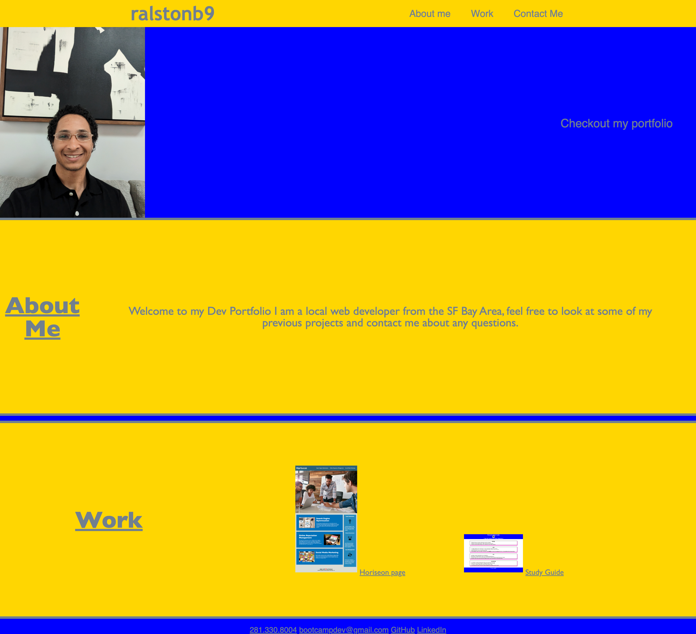

# dev-portfolio

## Description
In this weeks challenge I was tasked with creating a professional developer portfolio. For this challenge I was not given any starter code and was told to create a webpage with a picture and information about myself and previous projects I have worked on. I also needed to include a navbar with functioning links to the different sections on our page and pictures of our projects with links to the deployed pages.

## Project Link

https://ralstonb9.github.io/dev-portfolio/

## Screenshot

## Usage
This project can be used by possible employers to assess my current knowledge and skill in HTML as well as advanced CSS styling at this current point in time by interacting with the page and folowing the links to my other projects. it can also be used as a reference for myself or others when designing and styling a webpage or portfolio of their own by reviewing the code  that I have written.